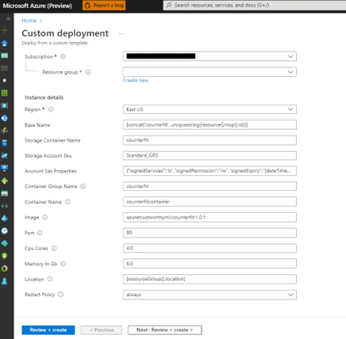
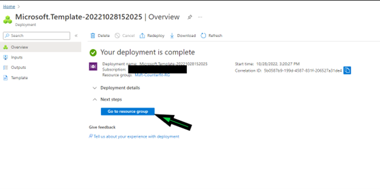
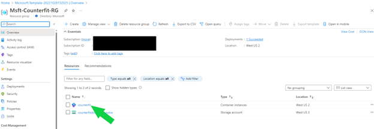
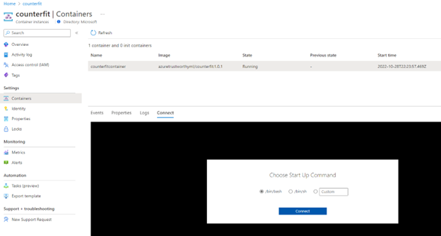
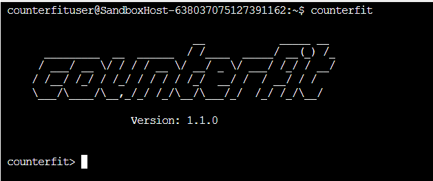

# Counterfit

[](https://github.com/Azure/counterfit/actions/workflows/tests.yaml)
[](https://github.com/Azure/counterfit/actions/workflows/testcoverage.yaml)
[](https://github.com/Azure/counterfit/blob/main/LICENSE)

[About](#About) | [Getting Started](#Getting-Started) | [Acknowledgments](#Acknowledgments) | [Contributing](#Contributing) | [Trademarks](#Trademarks) | [Contact Us](#Contact-Us)

```
                          __            _____ __
  _________  __  ______  / /____  _____/ __(_) /_
 / ___/ __ \/ / / / __ \/ __/ _ \/ ___/ /_/ / __/
/ /__/ /_/ / /_/ / / / / /_/  __/ /  / __/ / /
\___/\____/\__,_/_/ /_/\__/\___/_/  /_/ /_/\__/

                                        #ATML

---------------------------------------------------
```

## **About**
Counterfit is a generic automation layer for assessing the security of machine learning systems. It brings several existing adversarial frameworks under one tool, or allows users to create their own. 

## **Requirements**
To run this tool, you need to have the following softwares installed:
1. Python 3.8 or higher
2. Miniconda or Anaconda distribution installed from the URL specified below:
    - Miniconda: https://docs.conda.io/en/latest/miniconda.html
    - Anaconda: https://www.anaconda.com/products/distribution
3. Git installed from the url https://git-scm.com/downloads to clone the `counterfit` repository. 

> **Note: Support for running `Counterfit` on Windows and macOS is currently a work in progress. Please stay tuned for updates on when this feature will be available.**


## **Operating System Support**
This project is compatible with the following operating systems:
  - Linux (Ubuntu 18.04+)
  - Windows using WSL(Ubuntu 18.04+)

## **Cloud Support**
This project can be deployed and run on the following cloud platforms:
  - Microsoft Azure

To deploy and run this project on each of these operating systems locally or cloud, follow the instructions provided in the following `Running the Counterfit` documentation for each platform.


## **Running the Counterfit**

Choose one of these methods to get started quickly:

- [Option 1: Using Microsoft Azure](#option-1-using-microsoft-azure)
- [Option 2: Using Linux or Windows using WSL locally](#option-2-using-linux-or-windows-using-wsl-locally)

For more information including alternative installation instructions, please visit our [wiki](https://github.com/Azure/counterfit/wiki).

### **Option 1: Using Microsoft Azure**

#### **Prerequisites:**

You need an Azure account to be able to deploy Counterfit in Microsoft Azure Cloud.

Note: If you do not already have an Azure subscription, you can begin by obtaining a complimentary Azure subscription that comes with a credit of 200 USD. 

#### **Sign up for a free Azure Account:**

1. In a web browser, go to https://azure.microsoft.com/free.

2. Select Start free.

3. Sign in with your Microsoft or GitHub account or create a free Microsoft account if you do not have an account.

4. On the `Your profile` page, select your correct country or region. Enter your first and last name, email address, and phone number. Depending on your country or region, you might see additional fields, such as a VAT number. Select Next to continue.

5. On the Identity verification by phone screen, type the number of a telephone to which you have immediate access.

6. You have the option of text or callback to obtain a verification code. Select the relevant button, type the code in the Verification code box, and select Verify code.

7. If the verification code is correct, review the customer agreement and privacy statement then select the checkbox and select next.

8. On the `Identity verification by card` page, please enter details of a valid credit card. Enter the card information and select Sign Up.

9. Once Azure account is created, select `Go to the Azure portal` and you should be able to see the image as shown below.


#### **To deploy and run Counterfit on Azure Cloud**

1. Click the button below to initiate small resource deployment to your Azure account.

    [](https://portal.azure.com/#create/Microsoft.Template/uri/https%3A%2F%2Fraw.githubusercontent.com%2FAzure%2Fcounterfit%2Fmaster%2Finfrastructure%2Fazuredeploy.json)

2. In the configuration blade, select your Subscription name (for new Azure account users, it will be `Azure subscription 1`), Resource group (Create new if you do not have one.), and Region from the drop-down menu as shown below. Do not change other field values.
    
    

3. The above deployment would take approximately 5-8 minutes approximately. This deployment involves creating Azure Storage Account resource for storing Counterfit generated original and adversarial images and Azure Container Instance resource for running Counterfit.

4. Once deployment is successful, you can get into the Azure Container Instance using the below 2 options.

    a. Using Azure Shell, click the link [Azure Shell](https://shell.azure.com) and sign-in to your Azure Subscription, type the following command in the Azure Shell terminal by replacing `RESOURCE_GROUP` with the name of the resource group selected/created in the previous ARM deployment step.

    ```
    az container exec --resource-group <RESOURCE_GROUP> --name counterfit --exec-command '/bin/bash'
    ```

    b. Using Azure Container Instance(ACI), follow the below steps if you would like to run Counterfit directly in the ACI instance 
        
    + Once deployment is successful, go to the Azure Resource Group and select `counterfit` Azure Container Instance resource as shown below.

        
        
    + Once the above step is completed, it will take you to the `Container instance` page, click `Containers` under `Settings` section on the left side and click `Connect` from the menu and hit `Connect` button again.
    
        

5. Within the container terminal, launch Counterfit using the command `counterfit` in the terminal. Once Counterfit is loaded, you should be able to see a banner as shown below

    


#### **Steps to clean up the Azure Resources**

1. Go to the resource group in the Azure portal.
2. Click on the "Delete resource group" button at the top of the page.
3. Confirm the deletion by typing the name of the resource group in the text box provided.
4. Click on the "Delete" button to delete the resource group, along with all the resources that were deployed as part of this process.

This will ensure that the Azure Container Instance and Storage Account that were deployed as part of this process are also deleted and you will not incur any further charges. Here's a screenshot to help guide you: 

#### **Steps to delete an Azure Account**

Here's a link to the official Microsoft documentation on how to cancel an Azure subscription and Azure account: https://docs.microsoft.com/en-us/azure/cost-management-billing/manage/cancel-azure-subscription

### **Option 2: Using Linux or Windows using WSL locally**

#### **Using Windows with WSL**

>** Note: If you do not have WSL installed on your Windows machine, you can follow the installation instructions provided by Microsoft at https://learn.microsoft.com/en-us/windows/wsl/install.

To create a conda virtual environment for this tool, it is recommended to have miniconda/anaconda installed on your machine. This will allow you to easily manage and maintain dependencies for your project within a separate virtual environment.


#### Installation with Python virtual environment, follow these steps
```bash
sudo apt install python3.8 python3.8-venv
python -m venv counterfit
git clone -b main https://github.com/Azure/counterfit.git
cd counterfit
pip install .[dev]
python -c "import nltk;  nltk.download('stopwords')"
```

#### Installation with Conda, follow these steps 

1. Create a conda environment using the following command:
    ```bash 
    conda create --yes -n counterfit python=3.8.0
    ```
2. Activate the environment using the following command:  
    ```bash 
    conda activate counterfit
    ```
3. Clone the repo using the following command:
    ```bash 
    git clone https://github.com/Azure/counterfit.git
    ```
4. Change to the Counterfit directory using the following command:
    ```bash 
    cd counterfit
    ```
5. Install the development requirements using the following command:
    ```bash 
    pip install .[dev]
    ```
6. Download the additional file required for text attack functionality using the following command:
    ```bash 
    python -c "import nltk;  nltk.download('stopwords')"
    ```

To start the Counterfit terminal, run `counterfit` from your Windows or Linux shell.
```bash
$ counterfit

                              __            _____ __
      _________  __  ______  / /____  _____/ __(_) /_
     / ___/ __ \/ / / / __ \/ __/ _ \/ ___/ /_/ / __/
    / /__/ /_/ / /_/ / / / / /_/  __/ /  / __/ / /
    \___/\____/\__,_/_/ /_/\__/\___/_/  /_/ /_/\__/

                    Version: 1.1.0


counterfit>
```

Alternatively, you can also import the counterfit module from within you Python code. 
```python
import counterfit
import counterfit.targets as targets


target = targets.CreditFraud()
target.load()
attack_name = 'hop_skip_jump'
new_attack = counterfit.Counterfit.build_attack(target, attack_name)
results = counterfit.Counterfit.run_attack(new_attack)
```

See the [Counterfit examples README.md](examples/README.md) for more information.

Notes: 
- If textattack has been installed, it will initialize by downloading nltk data


## **Attack Support**

Each of the Counterfit targets supports a different data type (i.e., text,
tabular, and image). For an attack to be compatible, it has to be able to work
on that type of data as well.

For example, Hop Skip Jump, is an evasion and closed-box attack that can be used
for image and tabular data types. As such, it will be able to be used against 
Digits Keras (because it accepts images as input) but not Movie Reviews (because
it accepts text as input). It's important to ensure that the target supports the
specific attack before running an attack. 

To get a full view of the attack and targets, run the `list targets` and `list
 attacks` command. 

- **Text Targets**: movie_reviews
- **Text Attacks**: a2t_yoo_2021, bae_garg_2019, bert_attack_li_2020, checklist_ribeiro_2020, clare_li_2020, deepwordbug_gao_2018, faster_genetic_algorithm_jia_2019, genetic_algorithm_alzantot_2018, hotflip_ebrahimi_2017, iga_wang_2019, input_reduction_feng_2018, kuleshov_2017, morpheus_tan_2020, pruthi_2019, pso_zang_2020, pwws_ren_2019, seq2sick_cheng_2018_blackbox, textbugger_li_2018, textfooler_jin_2019,

 
- **Image Targets**: digits_keras, digits_mlp, satellite
- **Image Attacks**: boundary, carlini, copycat_cnn, deepfool, elastic_net, functionally_equivalent_extraction, hop_skip_jump, knockoff_nets, label_only_boundary_distance, mi_face, newtonfool, pixel_threshold, projected_gradient_descent_numpy, saliency_map, simba, spatial_transformation, universal_perturbation, virtual_adversarial, wasserstein, ApplyLambda, Blur, Brightness, ChangeAspectRatio, ClipImageSize, ColorJitter, Contrast, ConvertColor, Crop, EncodingQuality, Grayscale, HFlip, MemeFormat, Opacity, OverlayEmoji, OverlayOntoScreenshot, OverlayStripes, OverlayText, Pad, PadSquare, PerspectiveTransform, Pixelization, RandomEmojiOverlay, RandomNoise, Resize, Rotate, Saturation, Scale, Sharpen, ShufflePixels, VFlip


- **Tabular Targets**: cart_pole, cart_pole_initstate, creditfraud
- **Tabular Attacks**: boundary, carlini, deepfool, elastic_net, functionally_equivalent_extraction, hop_skip_jump, knockoff_nets, label_only_boundary_distance, mi_face, newtonfool, projected_gradient_descent_numpy, saliency_map, spatial_transformation


## **Acknowledgments**
Counterfit leverages excellent open source projects, including,

- [Adversarial Robustness Toolbox](https://github.com/Trusted-AI/adversarial-robustness-toolbox)
- [TextAttack](https://github.com/QData/TextAttack)
- [Augly](https://github.com/facebookresearch/AugLy)


## **Contributing**

This project welcomes contributions and suggestions. Most contributions require you to agree to a
Contributor License Agreement (CLA) declaring that you have the right to, and actually do, grant us
the rights to use your contribution. For details, visit https://cla.opensource.microsoft.com.

When you submit a pull request, a CLA bot will automatically determine whether you need to provide
a CLA and decorate the PR appropriately (e.g., status check, comment). Simply follow the instructions
provided by the bot. You will only need to do this once across all repos using our CLA.

This project has adopted the [Microsoft Open Source Code of Conduct](https://opensource.microsoft.com/codeofconduct/).
For more information see the [Code of Conduct FAQ](https://opensource.microsoft.com/codeofconduct/faq/) or
contact [opencode@microsoft.com](mailto:opencode@microsoft.com) with any additional questions or comments.

## **Trademarks**

This project may contain trademarks or logos for projects, products, or services. Authorized use of Microsoft
trademarks or logos is subject to and must follow
[Microsoft's Trademark & Brand Guidelines](https://www.microsoft.com/en-us/legal/intellectualproperty/trademarks/usage/general).
Use of Microsoft trademarks or logos in modified versions of this project must not cause confusion or imply Microsoft sponsorship.
Any use of third-party trademarks or logos are subject to those third-party's policies.

## **Contact Us**
For comments or questions about how to leverage Counterfit, please contact <counterfithelpline@microsoft.com>. 

